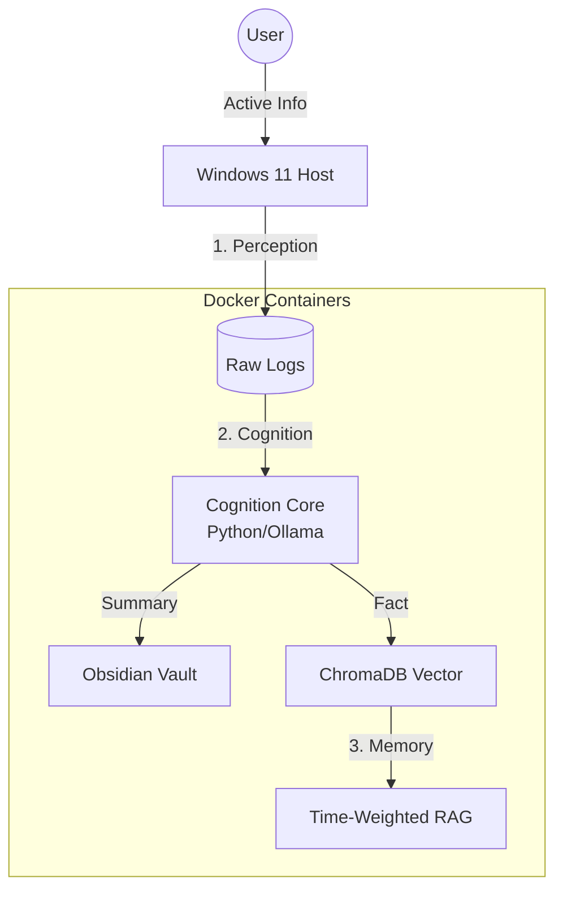

# 【完全ローカル】Local LLMで「自分だけのデジタルツイン」を構築し、日常ログを自動記録する仕組みを作った話

## はじめに

ブラウザ履歴や作業ログを外部サービスに送るのが不安で、
「行動データの分析はローカルだけで完結させたい」という目的があります。

そこで、**Ollama（Llama 3）** を使った完全ローカルの行動ログ分析システムを作りました。
この記事では、実際に動かしている構成・処理フロー・技術的な工夫をまとめています。

---

## システム構成の全体像

処理は大きく3つのステップで整理しています。



1. **Perception（知覚）**
   Windows上で作業ログ・ブラウザ履歴などの生データを収集

2. **Cognition（認知）**
   Docker内でPython + Ollama によりログを圧縮・要約・構造化

3. **Memory（記憶）**
   ObsidianとChromaDBに保存し、時系列と意味情報の両軸で検索可能にする

この3段構成で、PC内の情報の流れを“収集 → 理解 → 保存”に分解しています。

---

## ログ取得で直面した問題と対処

### ブラウザ履歴（SQLite）がロックされて読み取れない問題

Chrome系ブラウザは、起動中に履歴DBを排他ロックするため、
通常の `open()` や `sqlite3.connect()` では `PermissionError` が発生します。

#### 対策：Shadow Copy + リトライ

* 一時ディレクトリに履歴DBをそのままコピー
* コピー側をSQLiteとして読み取る
* ロック中なら指数関数的にリトライ（Exponential Backoff）
  という手順にしました。

```python
@retry(
    stop=stop_after_attempt(3),
    wait=wait_exponential(multiplier=1, min=1, max=4),
    retry=retry_if_exception_type(PermissionError)
)
def shadow_copy_history(src_path: Path, dest_path: Path):
    try:
        shutil.copy2(src_path, dest_path)
    except PermissionError:
        print(f"File locked: {src_path}. Retrying...")
        raise
```

履歴DBをコピーしたあとは普通にSQLで参照できます。
取得する情報はURL・タイトル・遷移時間など一般的なものだけに限定しています。

### サニタイズ

ログには長期保存したくない情報が紛れる場合があるため、

* メールアドレス
* クレジットカード番号形式
* セッションIDを含むURL
* 特定の除外ドメイン

などを正規表現で除去する処理を入れています。

---

## 大量ログをLLMに渡せる形式に整形する

### セッション化（Sessionization）

細かいウィンドウ切り替えイベントはそのままだとノイズになるので、
「行動として意味のある単位」にまとめる必要があります。

実装したルール例：

* 同じアプリ・同じURLに“一定時間（デフォルト5分）”以内に戻ったら同一セッション扱い
* 数秒単位のフリップイベントは無視して統合
* 作業開始・中断・再開の境界を簡易的に判定

これにより、ログ量は概ね 1/3〜1/5 程度まで圧縮されます。

### トークン上限に合わせたMap-Reduce

要約対象が多い場合は自動で分割し、チャンクごとに要約を実行（Map処理）。

```
The following logs are a partial segment of my day. Summarize them briefly into bullet points.
Logs: {logs}
```

チャンクを要約した後、全体を1つの“日単位サマリー”として統合（Reduce処理）する仕組みです。

---

## 記憶の仕組み：ベクトル検索と時系列を組み合わせる

ChromaDB を使ったRAG（検索 + LLM）の構成にしていますが、
行動ログは“いつの出来事か”が重要なので、単なるコサイン類似度だけでは不十分です。

### 時間を重み付けする再ランキング

検索時に、類似度スコアに「時間の減衰」を掛ける処理を入れています。

```python
# 類似度スコア (Base Score)
base_score = 1 / (1 + dist)

# 日数の経過を計算
days_old = (now_ts - event_ts) / 86400

# 減衰関数: 最近の出来事を優遇する
time_decay = 1 / (1 + 0.05 * days_old)

# 最終スコア
final_score = base_score * (1 + time_decay)
```

* 最近の記録：スコアが高く
* 古い記録：徐々にスコアが下がる

という挙動になります。
減衰率（0.05）は用途に応じて調整可能です。

---

## 全処理の自動化

継続運用を前提にしているため、
**毎日午前2時に自動実行されるバッチ処理**を組んでいます。

実装方法：

* Windows タスクスケジューラ → PowerShellスクリプトを起動
* Windows側でログ収集
* Dockerコンテナを起動してLLM処理を実行
* 完了後スリープに戻す

```powershell
Write-Log "Step 1: Running Sensor (Host)..."
python "$ProjectRoot\modules\sensor.py"

Write-Log "Step 2: Start Cognition (Docker)..."
docker compose run --rm core python modules/cognizer.py

# ... 処理終了後 ...
rundll32.exe powrprof.dll,SetSuspendState 0,1,0 
```

手動操作は不要で、毎日データが蓄積されていきます。

---

## 今後の拡張予定

現状は「行動ログ → 要約 → 検索」という基本機能のみですが、
いくつか追加予定の機能があります。

* **Unsloth を使った個別チューニング**
  Obsidianに蓄積した文章を学習データとして、軽量なローカルモデルを微調整予定。

* **WSL2を用いた学習パイプライン**
  GPUアクセラレーション環境をWSL2に組み込み、モデル更新をローカルで回す。

これらを追加することで、より“デジタルツインとしての役割”に近づけていく予定です。

---

*Keywords: Python, LocalLLM, Ollama, ChromaDB, ActivityWatch, Automation*
